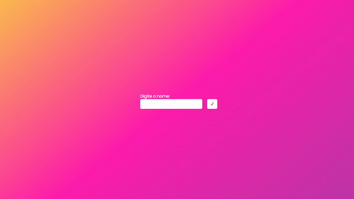

<h1  align="center"> Fake Backend</h1>
<p align="center">Este é um projeto de desenvolvimento de uma api backend básica com interação <strong>json</strong> através do <strong>json-server</strong>.</p>
<p align="center"> 
<a href="#-tecnologias-utilizadas">Tecnologias</a>&nbsp;&nbsp;&nbsp;|&nbsp;&nbsp;&nbsp;
<a href="#-dependências">Dependências</a>&nbsp;&nbsp;&nbsp;|&nbsp;&nbsp;&nbsp;
<a href="#-como-rodar-o-projeto">Como rodar</a>&nbsp;&nbsp;&nbsp;|&nbsp;&nbsp;&nbsp;
 <a href="#%EF%B8%8F-licença">Licença</a>
</p>
<div align="center">

</div>

---
&nbsp;
## 🚀 Tecnologias utilizadas
Esse projeto foi desenvolvido utilizando as seguintes tecnologias:

- Node.JS

- Javascript and Javascript Methods
- Git e Github
- Json-server
- Postman

&nbsp;
## ✅ Dependências
Esse projeto utiliza a seguinte dependência do **Node.js** para seu pleno desenvolvimento:

- json-server

&nbsp;
## 💻 Como rodar o projeto
Para rodar o projeto localmente no seu computador, as etapas a seguir podem ser seguidas:

1. Execute o comando: ```git clone https://github.com/AzzyPog/fake-backend.git``` no terminal de sua preferência. Entretanto, o terminal do [git](https://git-scm.com) é fortemente recomendado. 

2. Execute o comando ```npm install``` em seu terminal para instalar todas as dependências do projeto.
```bash
npm install
```

3. Execute o comando ```npm run server``` para servir o servidor na sua máquina através do seu terminal.
```bash
npm run server 
```

4. Utilizando a extensão [Live Server](https://marketplace.visualstudio.com/items?itemName=ritwickdey.LiveServer) ou extensão semelhante, roda o arquivo ```index.html``` em seu browser.

5. Após isso, tanto a página front quanto as rotas back devem estar funcionando plenamente, permitindo com que você envie e delete instâncias.

&nbsp;
## 🖊️ Licença
Este projeto está sob a Licença MIT. Veja o arquivo [LICENSE](LICENSE) para mais detalhes.

---
**Projeto feito por Renato Longo Filho. Qualquer dúvida ou informações, Entre em contato pelo e-mail renato.longo1406@gmail.com**